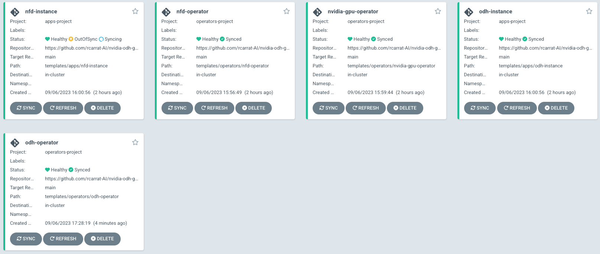
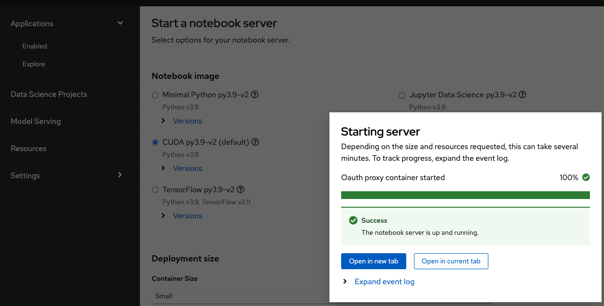
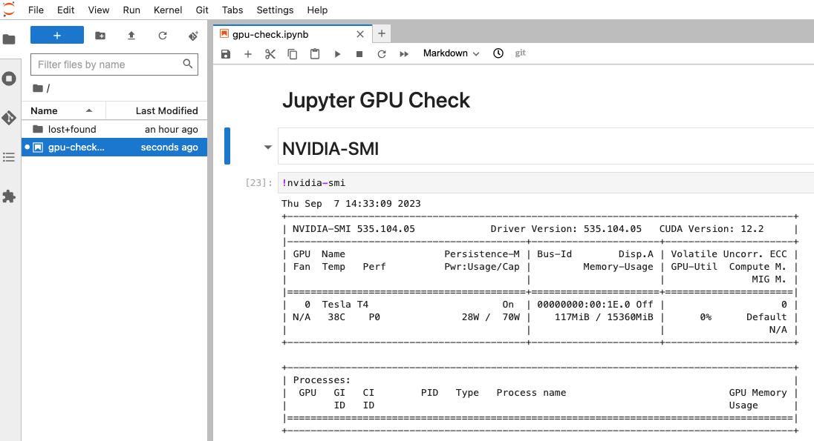

# Deploy RH OpenShift AI, Nvidia GPU Operator and Node Feature Discovery using GitOps!

Repository for provision OpenDataHub, Nvidia GPU Operator and Node Feature Discovery using GitOps



## Install ARO or ROSA cluster

* [Install ROSA Using Terraform](./templates/deploy_rosa/README.md)

## Install OpenShift GitOps

```sh
oc apply -k https://github.com/redhat-cop/gitops-catalog/openshift-gitops-operator/operator/overlays/latest
```

## Install all using OpenShift GitOps

```sh
oc apply -k deploy/
```

## Check the OpenShift GitOps status

```sh
echo "https://$(oc get route -n openshift-gitops openshift-gitops-server -o jsonpath='{.spec.host}')"
```

## Check the Open Data Hub Dashboard

* Retrieve the ODH Dashboard:

```sh
echo "https://$(oc get route -n odh odh-dashboard -o jsonpath='{.spec.host}')"
```

* Deploy a Data Science Project and a Workbench using the CUDA Image



* Upload (or clone) the [Jupyter Notebook for Check GPU](./templates/demo/gpu-check.ipynb)



## TODO 
* Add the [Nvidia GPU Operator Dashboard](https://docs.nvidia.com/datacenter/cloud-native/gpu-operator/latest/openshift/enable-gpu-op-dashboard.html)
* Add [Time Slicing / GPU Sharing](https://ai-on-openshift.io/odh-rhods/nvidia-gpus/#time-slicing-gpu-sharing)
