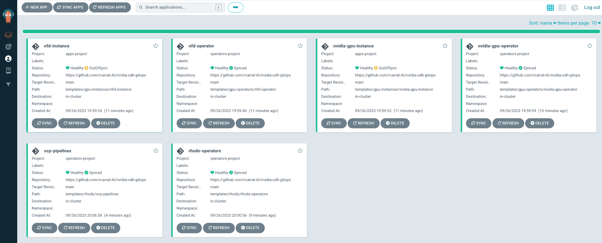

# Deploy RH OpenShift AI, Nvidia GPU Operator and Node Feature Discovery using GitOps!

Repository for provision OpenDataHub / Red Hat OpenShift Data Science, Nvidia GPU Operator and Node Feature Discovery using GitOps

# 1. Prerequisites

## 1.1 Install ARO or ROSA cluster

* [Install ROSA Using Terraform](./bootstrap-infra/deploy_rosa/README.md)

NOTE: Also works in OpenShift Self-Managed

## 1.2 Install OpenShift GitOps

```sh
oc apply -k https://github.com/redhat-cop/gitops-catalog/openshift-gitops-operator/operator/overlays/latest
```

Now it's time to choose to install OpenDataHub (upstream) or OpenShift Data Science.

# 3. Install **Open Data Hub** + Nvidia GPU Operator + NFD Operator


## 3.1 Install all using OpenShift GitOps

```sh
kubectl apply -k deploy/overlays/odh
```

## 3.2. Check the OpenShift GitOps status

```sh
echo "https://$(oc get route -n openshift-gitops openshift-gitops-server -o jsonpath='{.spec.host}')"
```

## 3.3 Check the Open Data Hub Dashboard

* Retrieve the ODH Dashboard:

```sh
echo "https://$(oc get route -n odh odh-dashboard -o jsonpath='{.spec.host}')"
```

# 4. Install Red Hat Open Data Science / OpenShift AI



```sh
kubectl apply -k deploy/overlays/rhods
```

# 5. Deploy a Demo

* Deploy a Data Science Project and a Workbench using the CUDA Image


* Upload (or clone) the [Jupyter Notebook for Check GPU](./templates/demo/gpu-check.ipynb)


## TODO 
* Add the [Nvidia GPU Operator Dashboard](https://docs.nvidia.com/datacenter/cloud-native/gpu-operator/latest/openshift/enable-gpu-op-dashboard.html)
* Add [Time Slicing / GPU Sharing](https://ai-on-openshift.io/odh-rhods/nvidia-gpus/#time-slicing-gpu-sharing)
